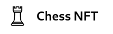

# CPSC 559 Final Project

<p align="center">
  
</p>

## Members
Dalton Caron - dpcaron@csu.fullerton.edu - 889226361 <br/>
Keerthi Vardhan Sovenahalli Karanam - Keerthiv@csu.fullerton.edu - 885935502 <br/>
Winnie Pan - wipan@csu.fullerton.edu - 888997434 <br/>
Jianxi Xu - xujianxi0607@csu.fullerton.edu - 802476051 <br/>

## Description

The title of our final project is “Chess NFT”, a decentralized application that supports the minting and trading of NFTs that represent played chess games. Our team consists of Keerthi Vardhan Sovenahalli Karanam, Winnie Pan, Jianxi Xu, and Dalton Caron. We have selected this project because there are many combinations of moves that can be made in a chess game. Some games played are quite extraordinary to the players, but ownership of chess games is not facilitated under United States copyright laws. NFTs can be used to mimic the notion of ownership, hence spawned the inspiration for this project topic. The goals of this project are to develop an NFT representation of chess games by encoding chess algebraic notation or some smaller encoding of chess games along with metadata onto the blockchain. A smart contract will be developed to facilitate this process. A frontend web application will be developed so users may easily buy, sell, and mint their own NFTs from a user-friendly interface. This project offers the challenges of developing such applications on and off the blockchain, but introduces the unique challenge of validating chess games either on the blockchain or with some off-chain oracle.

<hr>
<br>

This project was generated with [Angular CLI](https://github.com/angular/angular-cli) version 13.1.3

## Ganache

Install Ganache.

```
npm install -g ganache
```

Run Ganache.

```
ganache
```

## Truffle Smart Contracts

Run the Truffle migrations while Ganache is running.

```
truffle migrate
```

Replace the values in src/app/global-constants.ts with the addresses of the migrated contracts.

```javascript
export class GlobalConstants {

    public static chessNFTContractAddress: string = "PASTE HERE";
    public static marketplaceContractAddress: string = "PASTE HERE";

}
```

## Truffle Testing

To run all tests, do `truffle test`.

## Development server

Run `ng serve` for a dev server. Navigate to `http://localhost:4200/`. The app will automatically reload if you change
any of the source files.

## Code scaffolding

Run `ng generate component component-name` to generate a new component. You can also
use `ng generate directive|pipe|service|class|guard|interface|enum|module`.

## Build

Run `ng build` to build the project. The build artifacts will be stored in the `dist/` directory.

## Running unit tests

Run `ng test` to execute the unit tests via [Karma](https://karma-runner.github.io).

## Provider
This Dapp use web3modal allow us to use more wallet connectors
you can get more info [here](https://github.com/Web3Modal/web3modal)

## Get infura key

Create an infura account [here](https://infura.io/)
in web3.serrvice.ts line 31 insert your key in infuraId: ''

## Change Network

in ``web3.serrvice.ts`` line 56 you can change the network to your desire net
to  ``network: "mainnet",`` or ``network: "rinkeby",`` or ``network: "ropsten",``
